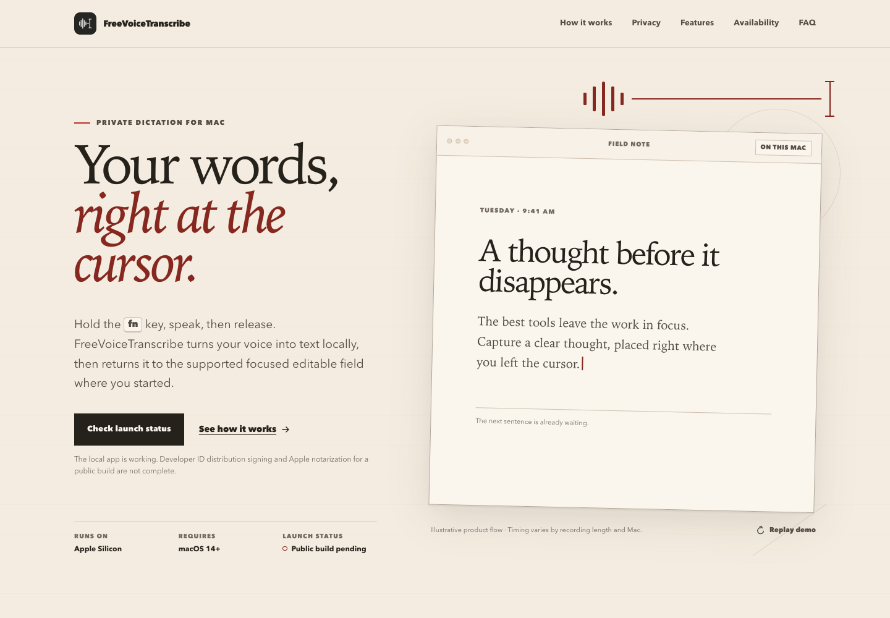

# FreeVoiceTranscribe

Private, local hold-to-talk dictation for Apple Silicon Macs. Focus an editable field, hold **fn/globe**, speak, and release to insert the transcript where you started.

FreeVoiceTranscribe is free, open-source software released under the [MIT license](./LICENSE).



## What it does

- Hold **fn** to record; release it to transcribe and insert.
- Press **fn + Space** while recording to switch to hands-free mode; press **fn** again to finish.
- Press **Esc** while recording to cancel and delete that recording.
- Recover the latest transcript with **Copy Last Transcript** or **Insert Last Transcript** from the menu bar.
- Transcribe locally with the `distil-large-v3` model through `lightning-whisper-mlx`.
- Process recorded PCM audio in process, including immediately after model setup; no ffmpeg install is required.
- Limit each recording to five minutes.

FreeVoiceTranscribe has no account system, cloud transcription, transcript history, or always-on microphone. It is a menu-bar app after setup and does not remain in the Dock.

## Requirements

| Use | Requirements |
| --- | --- |
| Run from source | Apple Silicon Mac, macOS 14+, Python 3.11–3.13, PortAudio |
| Build the app | The same hardware and OS, plus a framework-capable arm64 Python 3.11 |
| First setup | Internet access and enough free space for the one-time speech-model download |

Install PortAudio with Homebrew:

```bash
brew install python@3.11 portaudio
```

Homebrew Python 3.11 is the recommended release-build interpreter. Static or standalone Python distributions are rejected because `py2app` cannot build a complete runtime from them.

## Supported languages

The default `distil-large-v3` model supports **English speech recognition**.
It is downloaded during setup, not bundled in the app. Other languages are not
supported by this default model; the app currently has no model/language selector.
See the [upstream model card](https://huggingface.co/distil-whisper/distil-large-v3).

## Audio input device

FreeVoiceTranscribe records from your default input device. To use a specific microphone or USB audio interface, set it as the system default input before recording.

If you need better guidance for setup, use **Open Microphone Settings** from the setup window or the app menu bar when available.

## Install and run from source

Use an Apple Silicon terminal (not Rosetta) on macOS 14 or newer. Install the
prerequisites above, then clone the project:

```bash
git clone https://github.com/Sdefendre/freevoicetranscribe.git
cd freevoicetranscribe
```


The launcher creates `.venv` with the first compatible Python it finds (3.13, then 3.12, then 3.11), installs the pinned runtime requirements when `requirements.txt` changes, and starts the package entry point:

```bash
./run.sh
```

You can also create the environment manually:

```bash
/opt/homebrew/bin/python3.11 -m venv .venv
.venv/bin/python -m pip install -r requirements.txt
PYTHONPATH="$PWD" .venv/bin/python -m fvt
```

For a regular package install, the same direct dependencies are declared in `pyproject.toml`:

```bash
/opt/homebrew/bin/python3.11 -m venv .venv
.venv/bin/python -m pip install .
.venv/bin/freevoicetranscribe
```

`requirements.txt` pins direct source dependencies. `requirements.lock` contains the fully resolved runtime environment, while `requirements-build.lock` also includes build tooling. To reproduce the locked runtime:

```bash
.venv/bin/python -m pip install -c requirements.lock .
```

If installation reports `portaudio.h` missing, run `brew install portaudio`
and retry. If an existing `.venv` belongs to an unsupported Python, rename it
and recreate it with the explicit Python 3.11 command above. Python 3.14 and
Intel/Rosetta Python are not supported.

## First launch

The setup window guides you through three prerequisites:

1. **Microphone access** — captures only recordings you explicitly start.
2. **Accessibility access** — detects the global shortcut, verifies the focused editable field, and pastes the result.
3. **Speech model** — downloads the local `distil-large-v3` model once.

After changing a permission in **System Settings → Privacy & Security**, return to FreeVoiceTranscribe and refresh setup. Packaged and source runs have different macOS permission identities, so switching between them may require granting access again.

### Compatible editable fields

Once setup is complete, focus an enabled editable field in another app before pressing **fn**. Apps with custom editors, web-based text fields without native Accessibility support, password fields, terminal shells without input permission, or remote desktop session controls may not expose a compatible target.

If you see **No editable text field is available**, try this before reporting a bug:

- Click directly inside a text field in a supported app.
- Stop screen-sharing or remote desktop sessions.
- Quit the input-consuming app and reopen the text field.
- Disable automation or scripting add-ons for the target app, then retry.

If the issue persists, use **Send Feedback** in the menu bar.

## Privacy and local data

- The microphone opens only while recording.
- Inference runs locally after the one-time model download.
- Recordings are private 16 kHz mono temporary WAV files. They are deleted after transcription, error, or cancellation; crash leftovers are removed at the next launch.
- Exactly one transcript is persisted locally for recovery. A newer transcript replaces it; there is no history.
- Automatic insertion temporarily stages text on the clipboard. The previous clipboard is restored only if no other app changed it, so newer clipboard contents are preserved.
- The app captures the original process and exact focused editable Accessibility element. It verifies both again before insertion and fails closed rather than typing into another field.
- If verification or insertion fails, the transcript is copied to the clipboard. If copying also fails, it remains available from the menu bar.
- Rotating diagnostics contain event and error types, never transcript text.

Local files live outside the source tree and app bundle:

```text
~/Library/Application Support/FreeVoiceTranscribe/
├── device-settings.json    persisted device and shortcut preferences (mode 0600)
├── last-transcript.json    latest transcript only (mode 0600)
└── mlx_models/             downloaded speech model

~/Library/Caches/FreeVoiceTranscribe/
├── Temporary/              temporary recordings
└── huggingface/            model-download cache

~/Library/Logs/FreeVoiceTranscribe/
├── app.log                 current diagnostic log
├── app.log.1               rotated log, when present
└── app.log.2               rotated log, when present
```

Application directories are created with private permissions when the filesystem permits it. `app.log` rotates at 512 KiB with two backups.

## Feedback and bug reports

Use **Send Feedback** in the menu bar. It opens the GitHub new-issue page; include your app version and steps to reproduce the problem. You can also open issues directly at https://github.com/Sdefendre/freevoicetranscribe/issues/new.

## Build the macOS app

The release script creates or refreshes `.build-venv` from `requirements-build.lock`, builds in a staging directory with `py2app`, signs the staged app, verifies it, and publishes only a passing artifact:

```bash
./build_app.sh
```

A failed rebuild preserves the previous app in `dist/`. Successful output replaces it at:

```text
dist/FreeVoiceTranscribe.app
```

Use a specific compatible interpreter when needed:

```bash
PYTHON=/opt/homebrew/bin/python3.11 ./build_app.sh
```

The default is an ad-hoc signature for local testing. To exercise the hardened-runtime signing path with an installed Developer ID identity:

```bash
CODESIGN_IDENTITY="Developer ID Application: Your Name (TEAMID)" ./build_app.sh
```

To retain failed staging output for diagnosis instead of deleting it:

```bash
FVT_RETAIN_FAILED_STAGING=1 ./build_app.sh
```

The retained files appear under `build/failed-release/`, never `dist/`.

### Install a locally built app

Quit any running copy, then copy `dist/FreeVoiceTranscribe.app` into your
Applications folder and open that copy. No separate Python or PortAudio install
is needed to run the built bundle. Complete setup again if macOS requests new
Microphone or Accessibility permissions. Keep the app in the same location after
setup so those permissions refer to the copy you actually use.

### Release archives and public distribution

The tag workflow builds an **ad-hoc signed review artifact**, packages it with
`ditto` (preserving executable permissions and framework symlinks), and attaches
the ZIP and SHA-256 checksum to a **draft** GitHub Release. A green workflow does
not mean the app is notarized or publicly installable. CI does not import a
Developer ID certificate; setting an identity name alone cannot sign a runner's
build with that certificate.

For a public release, build using an installed Developer ID Application identity,
complete hardened-runtime/entitlement review, submit an archive to Apple's notary
service, staple the accepted ticket to the app, and verify Gatekeeper on a clean
supported Mac. Recreate the ZIP **after** stapling and replace the draft assets and
checksum before publishing. Apple signing credentials are required for these steps.

To package a verified local build:

```bash
ditto -c -k --sequesterRsrc --keepParent dist/FreeVoiceTranscribe.app dist/FreeVoiceTranscribe-macos-arm64.zip
(cd dist && shasum -a 256 FreeVoiceTranscribe-macos-arm64.zip > FreeVoiceTranscribe-macos-arm64.zip.sha256)
```

Do not upload the raw `.app` directory through `upload-artifact`; its archive
handling does not preserve the bundle's executable permissions.

### Build gates

Before publishing to `dist/`, the build verifies:

- a bundled Python runtime with no copied virtual environment or external symlink;
- required Python and native modules, including MLX and Numba/OpenMP;
- arm64 native code with resolvable library dependencies;
- absence of model files from the signed bundle;
- nested and outer code signatures;
- a terminating isolated import smoke test; and
- normal app startup followed by menu-bar-loop liveness.

The smoke tests do not request Microphone or Accessibility access.

Developer ID signing alone is not a public release. Distribution still requires appropriate entitlements and hardened-runtime review, Apple notarization, stapling, Gatekeeper validation, and testing on a clean supported Mac.

## Development

Install the development tools into the source environment:

```bash
.venv/bin/python -m pip install -e '.[dev]'
```

Run the checks:

```bash
.venv/bin/python -m unittest discover -s tests -v
.venv/bin/python -m ruff check .
.venv/bin/python -m ruff format --check .
bash -n run.sh build_app.sh
```

Validate a candidate release-build interpreter separately:

```bash
/opt/homebrew/bin/python3.11 scripts/validate_build_python.py
```

Verify an existing bundle without rebuilding it:

```bash
.build-venv/bin/python scripts/verify_bundle.py \
  --launch-import-smoke \
  --launch-liveness-smoke \
  dist/FreeVoiceTranscribe.app
```

Use `--skip-signature` only for isolated verifier fixtures; it is not a release validation mode.

## Architecture

```text
fvt/app.py             application composition and lifecycle
fvt/state.py           legal states and immutable snapshots
fvt/audio.py           bounded capture and device-aware WAV handling
fvt/transcription.py   local model readiness and PCM transcription
fvt/hotkey.py          resilient fn, fn+Space, and Esc event tap
fvt/insertion.py       exact target validation and safe clipboard insertion
fvt/permissions.py     macOS permission checks and Settings recovery
fvt/storage.py         private paths, latest transcript, and rotating logs
fvt/ui.py              setup window, menu bar, and multi-display HUD
scripts/               build interpreter, bundle, and launch verification
site/                  static noindex product preview
```

The root `freevoicetranscribe.py`, `fn_listener.py`, and `overlay.py` files are compatibility shims for earlier imports and launch commands. New code should use the `fvt` package.

## Contributing

See `CONTRIBUTING.md` for build instructions, testing expectations, and pull-request guidance.

## License and distribution

This project is released under the MIT License. See `LICENSE` for the full terms.
